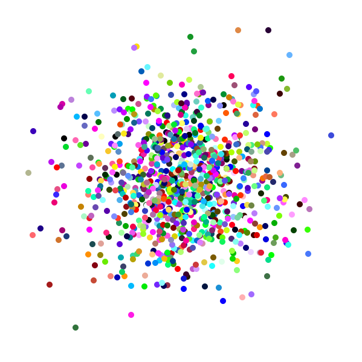

# Nature of code
Exercises from <a href="https://natureofcode.com/">Nature of code</a>
### Random walker 
4 possible direction + 1 possibility to stay in current place, 
each has 10% of possibility and 50% of probabilty of moving in the direction of the mouse. 

### Normal distribution of random numbers
&mu; = 320, &sigma; = 100  
 
With graphic variant: &mu; = 30, &sigma; = 6:  

### Splatter 
A simulation of paint splatter drawn as a collection of colored dots. 

### Perlin noise  
2-D noise with 3 arguments (x, y and animation variable), that changes by time and make it dynamic.

